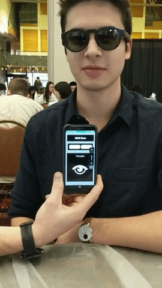

# KWM-Bose
Repo for BostonHack 2019 Bose AR spatial awareness and hands-free, voice-free control idea

#### Josh Wade, Spencer Kelly, Dan Molyneaux

KWM Bose is an Android application created using Android studio and Bose AR SDK. The application is intented for bluetooth integradion with Bose's AR compatible devices (Bose Frames, Bose Headphones 700 and QC35 headphones II.) When started, the application will prompt the user to connect to a Bose bluetooth device, once connected, the orientation of the device is used to control volume.

In awareness mode, a quick look left or right will lower the volume and turning back forward will return it to its original volume. This is intented to improve safety and spacial awareness for the user and to make the process of pausing music listening to talk to someone while working more seemless. Awareness mode can be toggled on and off by the user.

Tilting your head to either side will raise or lower the android device volume. 

### Reference:
	https://bosedevs.gitbook.io/bose-ar-android-workshop/
	
### Sensors:
	Accelerometer
	Gyroscope
	magnetometer

	Rotation:
	-Measures the orientation of the device relative to magnetic north
	-Uses the accelerometer, gyroscope, and magnetometer to derive the orientation value
	-Provides 4-dimension quaternion values
	-Quaternions emitted by the SDK are unit quaternions with a norm of 1
	-Unitless
	
### Quaternions

Quaternions are 4 dimensional complex numbers that can be used to represent an orientation or rotation in 3d space (specifically pure quaternions.) Compared to using Euler angles, which is the more common method for representing an orientation, quaternions do have no discontinuities or singularities. They also don't allow for gimbal lock. 

Quaternions were needed in this application to ensure that the difference in the initial and current orientation was continuous at any angle. 

# Functionallity:
	Play/Pause:
		Using the built in "head nod" function, music can be started and stop with a small head nod.
		
	Awareness Mode:
		By rotating your head at a specific speed to the left or right shoulder, music volume will be lowered to a 			certain level so you can more easily be aware of your surroundings. Especially useful when biking or running and 		 need to maintain vigilance.
		
	Volume Up/Down:
		Rolling your head to your left shoulder lowers volume and rolling to the right increases the volume. 
		
	Skip Songs:
		Using the built in "head shake" function, the user can skip to the next song.
		
	Easy to Use interface:
		User can disable some features if the want to limit sensor input.
		
# Future Goals:
	Go Pro Incorporation:
		Use a user input to set off video recording and picture taking on a Go Pro while doing an activity (Biking, boarding, 			etc...)
	Object Detection using microphones:
		Allow users to be warned when the microphones pick up incoming objects to keep them even more aware of impending
		dangers.
	User Customized Input:
		Let users customize some gestures to let them easily maneuver their music.
		
	
